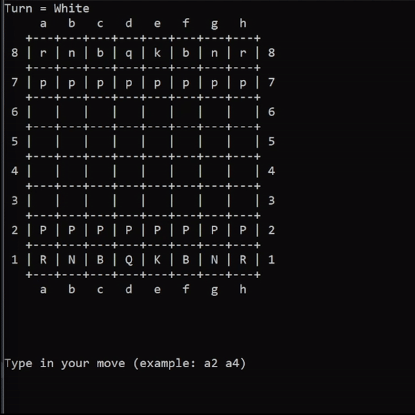

# Chess CLI♟️
Play chess in your Console! Control both White & Black pieces! ♟️



## Description
* Play chess in your Console. You control both white & black pieces.
* To move write starting square & destination square.
For example: a2 a5


## Getting Started

### Dependencies

* C++ compiler

### Installing

* Clone this project:
```bash
git clone https://github.com/SteponasK/Chess-CLI
```

### Executing program

* Change directory:
 ```bash
 cd Chess-CLI
 ```
* Open your IDE of choice
* Compile the project
* Enjoy!


## Authors

Contributors names and contact info

* Author - [Steponas K](https://github.com/SteponasK) 

## Version History

* 0.1
    * Initial Release

## License

This project is licensed under the MIT License - see the [LICENSE](LICENSE) file for details
